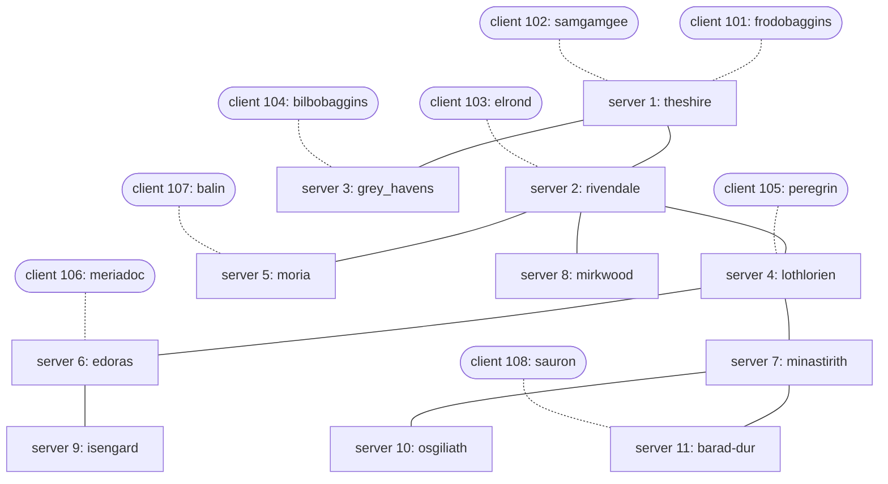

# Clemson Relay Chat (CRC) Protocol Specification

This document defines the required behavior of a CRC server. It is the
authoritative wire-format and routing specification; the docstrings in
`src/ChatServer.py` are only a summary. The message packing/parsing itself is
provided in `crc_support/ChatMessageParser.py` -- you build your server on top
of those message classes, you do not re-implement them.

## The network

A CRC network is a set of **servers** connected to one another, with **clients**
connected to individual servers. Every server keeps a network-wide view so that
a client on one server can message a client on any other server.

Each new server (except the very first) connects to **exactly one** existing
server when it starts up -- its bootstrap server. Because every server adds a
single edge to the server graph, the servers form an acyclic **spanning tree**.
There is exactly one path between any two hosts, so routing is just "forward
toward the destination along the tree." The tree is **static**: there is no
server-failure detection or re-routing. The only dynamic membership changes the
protocol handles are clients registering, clients quitting, and error-status
replies. (A Server Quit message, `0x02`, exists in the parser as optional extra
credit and is not exercised by the graded scenarios.)

### Simulated network layout

The test scenarios grow one topology incrementally -- the largest runs bring up
all **11 servers and 8 clients** below, staged over time so the harness can check
the network at different sizes. Server-to-server links are solid; each client
(dashed) attaches to exactly one server. There is a single path between any two
nodes -- that spanning tree is what your routing walks, one `first_link` hop at a
time.



Every machine (server or client) picks a random 32-bit id on joining, so your
code must key all per-host state by id, never by position in the tree.

## Message types

Every message begins with a one-byte message type, followed by fixed header
fields, followed by any variable-length UTF-8 string fields. All integer fields
use network byte order (big endian). The `struct` format string for each
message is shown as the unambiguous definition; it matches the `bytes()` /
constructor in `crc_support/ChatMessageParser.py`.

| Code | Class | Direction |
|---|---|---|
| `0x00` | `ServerRegistrationMessage` | server ↔ server |
| `0x01` | `StatusUpdateMessage` | server → server/client |
| `0x02` | `ServerQuitMessage` | optional / extra credit |
| `0x80` | `ClientRegistrationMessage` | client → server, server ↔ server |
| `0x81` | `ClientChatMessage` | client ↔ client (relayed by servers) |
| `0x82` | `ClientQuitMessage` | client → server, server ↔ server/client |

### `0x00` ServerRegistrationMessage — `!BIIBH{name}s{info}s`

| Field | Type | Size |
|---|---|---:|
| message type = `0x00` | byte | 1 |
| source id | unsigned int | 4 |
| last hop id | unsigned int | 4 |
| server name length | byte | 1 |
| server info length | unsigned short | 2 |
| server name | UTF-8 | variable |
| server info | UTF-8 | variable |

Fixed header is 12 bytes. Sent by a joining server to its bootstrap server, and
re-sent (rebroadcast) by servers to teach the rest of the tree about a server.

### `0x80` ClientRegistrationMessage — `!BIIBH{name}s{info}s`

Identical layout to the server registration message (12-byte fixed header),
with `client name` / `client info` string fields. A client sends this to its
server on startup; servers also exchange it to announce clients network-wide.

### `0x01` StatusUpdateMessage — `!BIIHI{content}s`

| Field | Type | Size |
|---|---|---:|
| message type = `0x01` | byte | 1 |
| source id | unsigned int | 4 |
| destination id | unsigned int | 4 |
| status code | unsigned short | 2 |
| message length | unsigned int | 4 |
| message string | UTF-8 | variable |

Fixed header is 15 bytes. Status codes:

- `0x00` — **Welcome.** `"Welcome to the Clemson Relay Chat network [name]"`,
  sent to a newly registered adjacent client.
- `0x01` — **Unknown destination id.** `"Unknown ID [X]"`, returned to a client
  that addressed a chat message to an id nobody has registered.
- `0x02` — **Duplicate id.** Returned when a registration reuses an id already
  in the network. The string differs by registrant type: a duplicate **server**
  registration returns `"A machine has already registered with ID [X]"`; a
  duplicate **client** registration returns `"Someone has already registered
  with ID [X]"`. In both cases `[X]` is the offending id and the reply is sent
  back over the same socket with destination id `0`.

A status message whose destination id equals the receiving server's id (or `0`)
is *for* that server: append its content to `self.status_updates_log` (used for
grading). Any other destination is forwarded toward that destination.

### `0x81` ClientChatMessage — `!BIII{content}s`

| Field | Type | Size |
|---|---|---:|
| message type = `0x81` | byte | 1 |
| source id | unsigned int | 4 |
| destination id | unsigned int | 4 |
| message length | unsigned int | 4 |
| message string | UTF-8 | variable |

Fixed header is 13 bytes. Forward it toward `destination_id` if that host is
known; otherwise return a `0x01` Unknown-ID status message to the sender.

### `0x82` ClientQuitMessage — `!BII{content}s`

| Field | Type | Size |
|---|---|---:|
| message type = `0x82` | byte | 1 |
| source id | unsigned int | 4 |
| message length | unsigned int | 4 |
| message string | UTF-8 | variable |

Fixed header is 9 bytes. Broadcast the quit to adjacent servers and adjacent
clients (never back toward the departing client), then remove the client from
`self.hosts_db` and, if adjacent, from `self.adjacent_user_ids`. Ignoring a quit
for a client you have already removed is what stops the broadcast from looping
around the tree forever.

## Registration, adjacency, and routing

### The `last_hop_id == 0` adjacency convention

A registration message's `last_hop_id` field encodes *who forwarded it*:

- `last_hop_id == 0` means an **initial registration** sent directly by the host
  that just connected to you -- so that host is **adjacent** to you.
- Otherwise the message was **relayed**, and `last_hop_id` is the id of the
  adjacent server that forwarded it to you.

When a server rebroadcasts a registration it sets `last_hop_id` to **its own
id** so the next server knows which neighbor to route back through. (A server
announcing *itself* onward therefore sends `last_hop_id == source_id`, which is
also treated as adjacent by the receiver.)

### `first_link_id` — the next hop toward a host

For every host it learns about, a server stores a `ServerConnectionData` or
`ClientConnectionData` in `self.hosts_db[id]` and records its
**`first_link_id`**: the id of the adjacent host that is the first step on the
path toward that destination.

- If the host is adjacent, `first_link_id` is the host's own id.
- If the host was learned via a relayed registration, `first_link_id` is the
  `last_hop_id` of that registration (the neighbor who told you about it).

`send_message_to_host(destination_id, message)` then routes purely locally:
look up `self.hosts_db[destination_id].first_link_id`, and append `message` to
`self.hosts_db[first_link_id].write_buffer`. Because `first_link_id` always
names an **adjacent** host (one you hold a direct socket to), the bytes leave on
the correct link. The next server repeats the same lookup, so a message walks
the spanning tree one hop at a time until it reaches its destination.

### What a server does on registration

On a **server registration** (`handle_server_registration_message`):

1. If `source_id` is already in `hosts_db`, reply with a `0x02` duplicate-id
   status over the same socket (via `send_message_to_unknown_io_device`, because
   the sender's id is not yet trusted) and stop.
2. Otherwise build a `ServerConnectionData`, set its `first_link_id`, and store
   it in `hosts_db`. If adjacent, add `source_id` to `adjacent_server_ids` and
   replace the socket's selector data with that `ServerConnectionData`.
3. If this is a brand-new adjacent server (`last_hop_id == 0`), **seed** it:
   send it your own `ServerRegistrationMessage` (with `last_hop_id == self.id`)
   and a `ServerRegistrationMessage` / `ClientRegistrationMessage` for every
   other host you already know (also `last_hop_id == self.id`) so it can route
   to them through you.
4. Rebroadcast the new server's registration to your other adjacent servers,
   ignoring the neighbor you learned it from (`first_link_id`).

On a **client registration** (`handle_client_registration_message`) the shape is
the same, with two differences: a newly adjacent client is sent a `0x00` Welcome
status and told about every existing client, and the registration is broadcast
to adjacent servers **and** adjacent clients (again skipping the source).

Use `isinstance(host, ServerConnectionData)` / `isinstance(host,
ClientConnectionData)` to tell stored hosts apart when seeding a new neighbor.

## Non-blocking I/O with `selectors` (no threads)

Your server must manage every connection with a single
`selectors.DefaultSelector` event loop and **non-blocking** sockets. Do **not**
use threads; the test harness already runs each server in its own thread and
your server must cooperate with a shared shutdown flag.

### Why non-blocking

Most socket operations -- `recv()`, `accept()`, `connect()`, and in principle
`send()` -- are *blocking*: the call does not return until it can complete. With
a single connection that is fine, but a CRC server juggles many sockets at once,
and blocking on one starves the rest. Say your server is watching two peers, A
and B. If you call `A.recv()` while A has nothing to say, the whole server halts
there -- even if B has a message waiting, and even if A is itself waiting on
something B was about to send. The server deadlocks.

A **selector** fixes this. You register every socket with the selector, then ask
it which sockets are *ready* before you touch them. You only ever call
`recv`/`send` on a socket the selector just reported as readable/writable, so no
individual call blocks.

### The pattern

Create one selector (do this in `__init__`):

```python
import selectors
self.sel = selectors.DefaultSelector()
```

Register each socket non-blocking, declaring whether you care about reading,
writing, or both, and attach a data object that carries this connection's state.
In this project that object is a `BaseConnectionData` / `ServerConnectionData` /
`ClientConnectionData`, and its `write_buffer` holds bytes queued to send. The
listening socket is registered with `data=None` so you can tell it apart:

```python
sock.setblocking(False)
events = selectors.EVENT_READ | selectors.EVENT_WRITE   # or just EVENT_READ
self.sel.register(sock, events, connection_data)
```

Drive everything from one loop. `select()` hands back the ready sockets plus a
mask of what each is ready for; act only on those:

```python
for io_device, event_mask in self.sel.select(timeout=0.1):
    sock = io_device.fileobj
    data = io_device.data
    if event_mask & selectors.EVENT_READ:
        recv_data = sock.recv(4096)
        if recv_data:
            self.handle_messages(io_device, recv_data)
        else:                                            # empty read = peer closed
            self.sel.unregister(sock); sock.close()
    if event_mask & selectors.EVENT_WRITE:
        if data.write_buffer:                            # only send when there is something
            sent = sock.send(data.write_buffer)
            data.write_buffer = data.write_buffer[sent:] # keep only what wasn't sent
```

Two things that trip students up: (1) `select()` almost always reports a socket
as writable, so you **must** check `write_buffer` is non-empty before sending and
trim it afterward, or you will spin sending empty/duplicate bytes; (2) the short
`timeout` matters -- it lets the loop surface each pass to check the shared
`request_terminate` flag instead of blocking forever inside `select()`. When you
are done with a socket, unregister and close it; close the selector on shutdown.

### Checklist

1. Create the selector in `__init__` (`self.sel`). Register the listening socket
   for `EVENT_READ` with a data value of `None` so you can tell it apart from
   message-passing sockets.
2. Accept new connections with a `BaseConnectionData` placeholder registered for
   `EVENT_READ | EVENT_WRITE`; you replace it with the right `ConnectionData`
   once you process that connection's registration message.
3. The main loop (`check_IO_devices_for_messages`) must call `self.sel.select`
   **inside** the loop with a short timeout (e.g. `0.1s`) so the server can
   notice `self.request_terminate` and shut down. Never make a blocking
   `select()`, `recv()`, `accept()`, or `send()` call.
4. Queue outgoing bytes in a connection's `write_buffer`; on an `EVENT_WRITE`,
   send the buffer only if it is non-empty and clear it afterward so you never
   resend the same bytes.
5. An empty `recv()` means the peer closed the connection -- unregister and close
   that socket.
6. `cleanup()` (called when the loop exits) must unregister and close every
   socket and close the selector. You can enumerate registered sockets with
   `list(self.sel._fd_to_key.values())`.

## Grading-visible state

The harness checks your server's observable state after each scenario, so keep
these accurate: `self.hosts_db` (id → connection data for every known host),
`self.adjacent_server_ids`, `self.adjacent_user_ids`, and
`self.status_updates_log`. Grading judges this final state and the messages
clients receive -- not the exact number or ordering of the messages your server
emits, as long as the network converges to the correct state.
